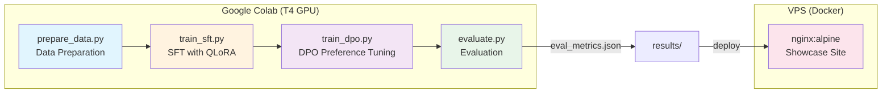

# CloudAura Fine-Tune

A four-stage QLoRA + DPO fine-tuning pipeline for structured JSON extraction, targeting Qwen2.5-1.5B-Instruct on a single T4 GPU.

## Architecture



### Pipeline Stages

| Stage | Script | Description |
|-------|--------|-------------|
| 1. Data Prep | `pipeline/scripts/prepare_data.py` | Loads UltraChat-200k (SFT) and Intel-Orca DPO pairs from Hugging Face, formats for JSON extraction task |
| 2. SFT | `pipeline/scripts/train_sft.py` | Supervised fine-tuning with QLoRA (4-bit NF4, LoRA r=16, ~0.6% trainable params) |
| 3. DPO | `pipeline/scripts/train_dpo.py` | Direct Preference Optimization on top of SFT adapter (beta=0.1, sigmoid loss) |
| 4. Eval | `pipeline/scripts/evaluate.py` | Compares Base vs SFT vs SFT+DPO on 8 held-out JSON extraction prompts |

## Quick Start

### Showcase Site (VPS)

```bash
# Clone the repository
git clone https://github.com/CloudAuraOfficial/cloudaura-finetune.git
cd cloudaura-finetune

# Copy environment file
cp .env.example .env

# Start the showcase site
docker compose up -d
```

The static showcase site will be available at `http://localhost:8004`.

### Training Pipeline (Google Colab)

1. Open `notebooks/finetune_pipeline.ipynb` in Google Colab
2. Select **T4 GPU** runtime
3. Run all cells sequentially
4. Download `results/eval_metrics.json` and place it in `results/` on the VPS

Alternatively, run the scripts individually:

```bash
cd pipeline/scripts
python prepare_data.py
python train_sft.py
python train_dpo.py
python evaluate.py
```

## Tech Stack

| Component | Technology |
|-----------|------------|
| Base Model | Qwen/Qwen2.5-1.5B-Instruct |
| Quantization | QLoRA (4-bit NF4, double quantization) |
| SFT Training | TRL `SFTTrainer` + PEFT `LoraConfig` |
| DPO Training | TRL `DPOTrainer` + `DPOConfig` |
| Optimizer | paged_adamw_8bit |
| SFT Dataset | HuggingFaceH4/ultrachat_200k (10k samples) |
| DPO Dataset | argilla/distilabel-intel-orca-dpo-pairs (5k pairs) |
| Showcase Site | nginx:alpine (static HTML/CSS/JS) |
| Tracking | Weights & Biases (optional) |
| Hardware | NVIDIA T4 GPU (16 GB VRAM) via Google Colab |

## Configuration

### Training Configuration (YAML)

#### SFT (`pipeline/config/sft_config.yaml`)

| Parameter | Value |
|-----------|-------|
| `model.base_model` | Qwen/Qwen2.5-1.5B-Instruct |
| `lora.r` | 16 |
| `lora.lora_alpha` | 32 |
| `lora.lora_dropout` | 0.05 |
| `lora.target_modules` | q_proj, k_proj, v_proj, o_proj, gate_proj, up_proj, down_proj |
| `training.num_train_epochs` | 3 |
| `training.per_device_train_batch_size` | 4 |
| `training.gradient_accumulation_steps` | 4 |
| `training.learning_rate` | 2e-4 |
| `training.lr_scheduler_type` | cosine |
| `training.max_seq_length` | 1024 |
| `data.max_train_samples` | 10000 |
| `data.max_eval_samples` | 500 |

#### DPO (`pipeline/config/dpo_config.yaml`)

| Parameter | Value |
|-----------|-------|
| `training.num_train_epochs` | 1 |
| `training.per_device_train_batch_size` | 2 |
| `training.gradient_accumulation_steps` | 8 |
| `training.learning_rate` | 5e-5 |
| `training.beta` | 0.1 |
| `training.loss_type` | sigmoid |
| `training.max_length` | 1024 |
| `training.max_prompt_length` | 512 |
| `data.max_train_samples` | 5000 |

### Environment Variables (`.env.example`)

| Variable | Description | Required |
|----------|-------------|----------|
| `HF_TOKEN` | Hugging Face access token | Yes |
| `WANDB_API_KEY` | Weights & Biases API key | No |
| `WANDB_PROJECT` | W&B project name | No |
| `BASE_MODEL` | Model identifier on Hugging Face | Yes |
| `TASK` | Training task (default: `json_extraction`) | Yes |
| `SFT_EPOCHS` | Number of SFT training epochs | Yes |
| `SFT_BATCH_SIZE` | SFT per-device batch size | Yes |
| `SFT_LEARNING_RATE` | SFT learning rate | Yes |
| `LORA_RANK` | LoRA rank | Yes |
| `LORA_ALPHA` | LoRA alpha scaling factor | Yes |
| `DPO_EPOCHS` | Number of DPO training epochs | Yes |
| `DPO_BATCH_SIZE` | DPO per-device batch size | Yes |
| `DPO_LEARNING_RATE` | DPO learning rate | Yes |
| `DPO_BETA` | DPO beta parameter (preference strength) | Yes |

## Evaluation

The evaluation script (`pipeline/scripts/evaluate.py`) runs 8 held-out JSON extraction prompts against three model variants and reports:

| Metric | Description |
|--------|-------------|
| Valid JSON Rate | Percentage of outputs that parse as valid JSON |
| Key F1 | F1 score for extracted JSON keys vs expected keys |
| Value Accuracy | Fraction of correctly extracted values |
| Latency | Average inference time per prompt |
| Tokens/sec | Generation throughput |

Results are saved to `results/eval_metrics.json` and consumed by the showcase site.

## Monitoring

The showcase site is a static nginx container with a health check:

```
HEALTHCHECK --interval=30s --timeout=5s --retries=3 \
    CMD wget -qO- http://localhost/ || exit 1
```

The container binds to `127.0.0.1:8004` and is exposed publicly via the host Nginx reverse proxy.

## Project Structure

```
cloudaura-finetune/
├── Dockerfile                  # nginx:alpine serving static site
├── docker-compose.yml          # Showcase site container
├── .env.example                # Environment variable template
├── notebooks/
│   └── finetune_pipeline.ipynb # Complete Colab notebook (all 4 stages)
├── pipeline/
│   ├── config/
│   │   ├── sft_config.yaml     # SFT hyperparameters
│   │   └── dpo_config.yaml     # DPO hyperparameters
│   └── scripts/
│       ├── prepare_data.py     # Dataset loading and formatting
│       ├── train_sft.py        # QLoRA supervised fine-tuning
│       ├── train_dpo.py        # DPO preference alignment
│       └── evaluate.py         # Multi-model comparison
├── results/                    # Evaluation metrics (JSON)
├── site/                       # Static showcase website
│   ├── index.html
│   └── css/
└── nginx/                      # Nginx configuration
```
